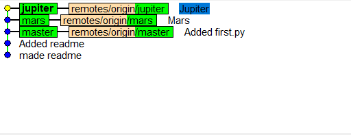
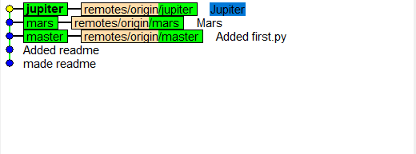

## Part 1

* Rory Eiffe
* 
* Graduating Year: 2021
* Project sub-area: Web Development

### git k

### git k-all

### git log --graph --oneline --decorate

## Part 2

### fork link:
https://github.com/roryeiffe/Spoon-Knife

### Learn Git Branching

## Part 3

### fork link:

https://github.com/roryeiffe/PullReq.git

### diff
