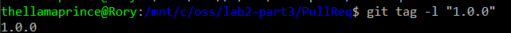

## Part 1

### Read Me:

https://github.com/roryeiffe/oss-lab2/blob/master/README.md

### git k

### git k-all

### git log --graph --oneline --decorate

## Part 2

### fork link:
https://github.com/roryeiffe/Spoon-Knife

### Learn Git Branching

## Part 3

### fork link:

https://github.com/roryeiffe/PullReq.git

### diff

### tag

### Shared Repo
https://github.com/roryeiffe/OSSProjectIdeas

